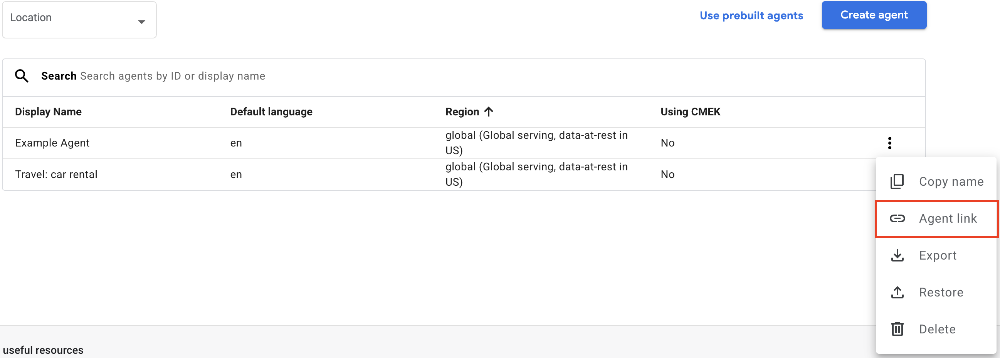

# React Native DFCX Component

This is a React Native implementation for Dialogflow CX conversational agents. It requires the chat function to be deployed within the same Google Cloud Platform project as your agent and provides a chat interface for use within a React Native application.

<p align="center">
  
</p>

The component supports the following standard Dialogflow response types in your conversation flows, as detailed in Google’s documentation: (https://cloud.google.com/dialogflow/cx/docs/concept/integration/dialogflow-messenger/fulfillment):

- Text: Simple text messages.
- Description: Multiline text with a header and body
- Info: An image width a text header and body, which can open a URL
- Image: Image URLs.
- Video: Video URLs.
- Button: Buttons with text and URLs.
- List: Lists of items with titles, subtitles, and images.
- Files: File attachments with names, images, and URLs.
- Chips: Quick reply options.
- Accordion: Expandable sections with titles and content.

> **NOTE** This component requires the chat Cloud Function to be deployed in the same Google Cloud project as your Dialogflow CX agent.

## Installation

```sh
npm install react-native-dfcx
```

## Basic Usage

```js
import { ChatDialog } from 'react-native-dfcx';

<ChatDialog
  chatURL="https://europe-west1-dotstorming.cloudfunctions.net/cx-chat"
  apiKey="cb2be986-6b84-4ab1-8eeb-b2fc40402077"
  agentPath="https://dialogflow.cloud.google.com/cx/projects/dotstorming/locations/global/agents/4459aa96-eebe-4419-8d28-77207f442165"
  sessionTimeout={30}
  mainColor="#ff0000"
  mainTextColor="#FFFFFF"
  sessionVariables={{
    userId: '12345',
    userName: 'John Doe',
  }}
/>;
```

## Properties

| Name             | Description                                                                                                 | Detail                         |
| ---------------- | ----------------------------------------------------------------------------------------------------------- | ------------------------------ |
| chatURL          | The URL of your deployed Dialogflow CX chat function.                                                       | **required** string            |
| apiKey           | The key required to call the chat function (if applicable).                                                 | string                         |
| agentPath        | The URL of the Dialogflow Agent you would like to connect to. See below to find out how to get this path.   | **required** string            |
| languageCode     | The language code of the Dialogflow CX agent.                                                               | string (default: 'en')         |
| sessionTimeout   | Time in minutes after which the session will reset and a new session ID will be generated.                  | number ( default: 30)          |
| placeholder      | The placeholder text for the chat input.                                                                    | string (default: 'Message...') |
| startMessage     | A hidden message sent to the Dialogflow agent when the session starts. Useful for seeding the conversation. | string                         |
| welcomeMessage   | A message displayed to the user when the session starts. This is not sent to Dialogflow.                    | string                         |
| mainColor        | The background color for user messages.                                                                     | **required** string            |
| mainTextColor    | The color that is used for the text of user inputs                                                          | **required** string            |
| sessionVariables | Session parameters to send with each user input.                                                            | object                         |

## Retrieving your Agent Path

To retrieve the agentPath, open the Dialogflow/Conversational Agents console and click the corresponding button in the agent list.

<p align="center">
  <br/>
  
  <br/>
</p>

This will place the agentPath into your clipboard for use in the component.
